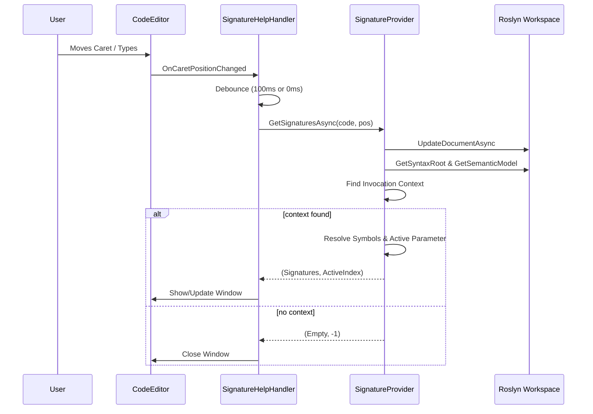

# Method Signature Help Workflow

This document details the internal working mechanism of the Method Signature Help feature in ScratchpadSharp, which displays parameter information and documentation when typing method calls.

## 1. Triggering Mechanism (`SignatureHelpHandler.cs`)

The signature help process is managed by `SignatureHelpHandler` and primarily relies on **caret position polling** (`OnCaretPositionChanged`) to maintain state, ensuring robustness against editing operations like deletion and pasting.

### Trigger Events
- **Caret Movement (`OnCaretPositionChanged`)**: 
  - Every time the caret moves, a request is scheduled (debounced by `100ms`).
  - This checks if the caret is currently inside a valid method invocation context.
  - If valid -> Shows or updates the window.
  - If invalid -> Closes the window.

- **Explicit Triggers (`HandleInput`)**:
  - `(` and `,`: Triggers an **immediate** update (debounce `0ms`) to provide instant feedback when typing arguments.

- **Keyboard Interaction (`HandleKeyDown`)**:
  - **Up/Down Arrows**: Manually navigates between method overloads (`SelectPreviousSignature` / `SelectNextSignature`).
  - **Escape**: Closes the signature help window.

### Request Flow
1.  **Debouncing**: 
    - Normal caret movement: `100ms` wait.
    - Explicit triggers (`(`, `,`): `0ms` wait.
2.  **Context Collection**:
    - Current Code: `CodeEditor.Document.Text`
    - Caret Position: `CodeEditor.CaretOffset`
    - Config: Usings and NuGet packages from `MainWindowViewModel`.
3.  **Service Call**: Calls `ISignatureProvider.GetSignaturesAsync`.
4.  **State Logic (`UpdateOrShowSignatureHelpAsync`)**:
    - If `signatures` are returned: Show window (if hidden) or Update ViewModel (if declared).
    - If `signatures` is empty: Close window.

## 2. Roslyn Processing (`SignatureProvider.cs`)

The core code analysis logic resides in `SignatureProvider`.

### Step 1: Workspace Preparation
- **Initialization Check**: Ensures `RoslynWorkspaceService` is ready.
- **Reference Update**: Updates references if new NuGet packages are used.
- **Document Update**: Updates the in-memory Roslyn document (`RoslynWorkspaceService.Instance.UpdateDocumentAsync`) with the current code and implicit usings.

### Step 2: Context Analysis (`FindInvocationContext`)
- **Node Finding**: Uses Roslyn's syntax tree (`GetSyntaxRootAsync`) to find the syntax node at the caret position.
- **Invocation Identification**: Walks up the syntax tree to find a compatible container:
  - `InvocationExpressionSyntax` (Method calls)
  - `ObjectCreationExpressionSyntax` (Constructor calls via `new`)
  - `BaseObjectCreationExpressionSyntax`
- **Validation**: Verifies that the caret is strictly within the method's parentheses arguments (`IsPositionInContext`).

### Step 3: Symbol Resolution
- **Semantic Model**: Uses `GetSemanticModelAsync` to obtain semantic information.
- **Symbol Lookup**:
  - For methods: `semanticModel.GetMemberGroup` returns all overloads.
  - For constructors: `semanticModel.GetTypeInfo` identifies the type, then retrieves all `public` constructors.
- **Filtering**: Distinct symbols are collected into a list of `ISymbol`.

### Step 4: Signature Extraction (`ExtractSignatures`)
- **MethodSignature Creation**: Converts Roslyn syntax symbols into the internal `MethodSignature` model.
- **Documentation Parsing**:
  - Retrieves XML documentation using `method.GetDocumentationCommentXml()`.
  - Parses `
`, `<param>`, and `<returns>` tags to provide rich descriptions.
- **Parameter Mapping**: Maps Roslyn parameters to `ParameterSignature` (Name, Type, Default Value, `params`, `optional`).

### Step 5: Parameter Tracking (`CalculateParameterPosition`)
- Analyzes the `ArgumentList` syntax.
- Compares the caret position against the spans of existing arguments and commas.
- accurately determines:
  - `activeParam`: The index of the parameter the user is currently typing.
  - Handles edge cases like being after the last comma or on an empty argument list.

## 3. UI Presentation (`SignatureHelpViewModel.cs`)

Back on the UI thread, the results are presented via `SignatureHelpWindow` and `SignatureHelpPopup`.

### ViewModel Logic
1.  **Overload Selection (`SelectBestMatchingOverload`)**:
    - Automatically selects the best overload based on the number of arguments typed so far.
    - Intelligently handles `params` arrays (counting them as a match for any number of excess arguments).
2.  **Parameter Highlighting**:
    - `UpdateParameterHighlights` sets `IsHighlighted` on the parameter matching the current argument index.
    - This creates the bold effect on the active parameter in the UI.

### View (`SignatureHelpPopup.axaml`)
- Displays the current signature's full text.
- Shows documentation summary.
- Lists parameters, bolding the active one.
- Shows "↑↓ 1 of N overloads" if multiple signatures exist.

## Summary Diagram

