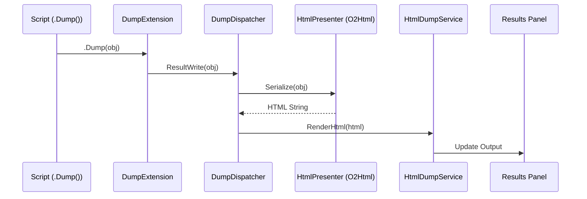

# Dump Mechanism Workflow

This document describes how the `.Dump()` extension method works in ScratchpadSharp, enabling rich object visualization within scripts.

## Overview

The Dump mechanism allows scripts to output objects in a structured, visual format (HTML) to the results panel. It is based on code ported from [NetPad](https://github.com/tareqimbasher/NetPad) and uses [O2Html](https://github.com/tareqimbasher/O2Html) for object serialization.

## Architecture

### 1. Script Compilation & Execution

When a script is compiled via `ScriptExecutionService`:
1.  **Imports**: The namespace `ScratchpadSharp.Core.External.NetPad.Presentation` is automatically added to the script's default usings (via `ScriptConfig`).
2.  **Extension Method**: This namespace exposes the static `DumpExtension.Dump<T>(this T obj, ...)` method.
3.  **Sink Registration**: Before execution, `ScriptExecutionService` initializes the `DumpExtension` with a `DumpSink`. Currently, this is handled via `DumpExtension.UseSink(new DumpDispatcher())`.

### 2. The `Dump()` Call

When a user calls `.Dump()` in their script:
1.  `DumpExtension.Dump<T>(obj)` is invoked.
2.  It calls `DumpDispatcher.ResultWrite<T>(obj, options)`.

### 3. Serialization (`DumpDispatcher`)

`DumpDispatcher` acts as the bridge (Sink) between the script's execution context and the UI.
1.  **Serialization**: Inside `Dispatch<T>` or `ResultWrite<T>`, the object is serialized to an HTML string using `HtmlPresenter` (which utilizes `O2Html`).
    *   `HtmlPresenter.Serialize(obj)` handles recursion, circular references, and specific type formatting (e.g., collections, images).
2.  **Dispatch**: The generated HTML string is passed to `DispatchHtml(string html)`.
3.  **UI Callback**: `DispatchHtml` invokes the registered `_htmlRenderer` delegate.

### 4. UI Rendering (`HtmlDumpService`)

In the main application (`ScratchpadSharp`):
1.  **Service Registration**: `HtmlDumpService` registers itself with `DumpDispatcher.RegisterHtmlRenderer(RenderHtml)`.
2.  **Style Loading**: On initialization, `HtmlDumpService` loads the embedded `NetPadStyles.css` (Legacy CSS compatible) from the core assembly.
3.  **Rendering**: When `RenderHtml` is called with the HTML string:
    *   It wraps the content in an HTML template that includes the loaded CSS in a `<style>` block.
    *   It wraps the body content in `<output-pane>` and `
` to matches NetPad's styling structure.
    *   It triggers an update callback (bound to the ViewModel).
    *   The `MainWindow` receives the full HTML string and renders it using `Avalonia.HtmlRenderer`.

## Key Components

-   **`DumpExtension`**: The public API available to scripts.
-   **`DumpDispatcher`**: The core service that handles object-to-HTML serialization and notifies the UI.
-   **`HtmlPresenter` / `O2Html`**: The engine responsible for traversing objects and generating the HTML representation.
-   **`HtmlDumpService`**: The UI-side service that listens for dump events and updates the view.

## Flow Diagram

