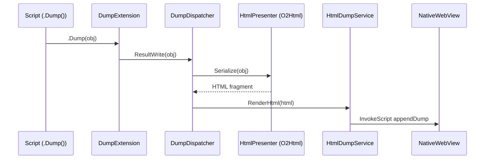

# Dump Mechanism Workflow

This document describes how the `.Dump()` extension method works in ScratchpadSharp, enabling rich object visualization within scripts.

## Overview

The Dump mechanism allows scripts to output objects in a structured, visual format (HTML) to the results panel. It is based on code ported from [NetPad](https://github.com/tareqimbasher/NetPad) and uses [O2Html](https://github.com/tareqimbasher/O2Html) for object serialization.

## Architecture

### 1. Script Compilation & Execution

When a script is compiled via `ScriptExecutionService`:
1.  **Imports**: The namespace `ScratchpadSharp.Core.External.NetPad.Presentation` is automatically added to the script's default usings (via `ScriptConfig`).
2.  **Extension Method**: This namespace exposes the static `DumpExtension.Dump<T>(this T obj, ...)` method.
3.  **Sink Registration**: Before execution, `ScriptExecutionService` initializes the `DumpExtension` with a `DumpSink`. Currently, this is handled via `DumpExtension.UseSink(new DumpDispatcher())`.

### 2. The `Dump()` Call

When a user calls `.Dump()` in their script:
1.  `DumpExtension.Dump<T>(obj)` is invoked.
2.  It calls `DumpDispatcher.ResultWrite<T>(obj, options)`.

### 3. Serialization (`DumpDispatcher`)

`DumpDispatcher` acts as the bridge (Sink) between the script's execution context and the UI.
1.  **Serialization**: Inside `Dispatch<T>` or `ResultWrite<T>`, the object is serialized to an HTML string using `HtmlPresenter` (which utilizes `O2Html`).
    *   `HtmlPresenter.Serialize(obj)` handles recursion, circular references, and specific type formatting (e.g., collections, images).
2.  **Dispatch**: The generated HTML string is passed to `DispatchHtml(string html)`.
3.  **UI Callback**: `DispatchHtml` invokes the registered `_htmlRenderer` delegate.

### 4. UI Rendering (`HtmlDumpService`)

In the main application (`ScratchpadSharp`):
1.  **Sink**: `HtmlDumpService` constructs a `DumpDispatcher` that calls `RenderHtml` for each dump.
2.  **Shell**: On first use, `HtmlDumpService.ShellHtml` is loaded into `NativeWebView` (NetPad CSS, extra layout CSS, and collapse JS).
3.  **Rendering**: When `RenderHtml` is called with an HTML fragment:
    *   The fragment is appended to an in-memory buffer.
    *   `FragmentAppended` notifies `ScriptTabView`.
    *   The view injects the fragment with `InvokeScript("appendDump", html)` so scroll and expand/collapse state are kept.
    *   `Clear()` empties the dump container without reloading the shell.

On Linux, WebKitGTK (`libwebkit2gtk-4.1-0`) must be installed; otherwise the pane shows an install hint.

## Key Components

-   **`DumpExtension`**: The public API available to scripts.
-   **`DumpDispatcher`**: The core service that handles object-to-HTML serialization and notifies the UI.
-   **`HtmlPresenter` / `O2Html`**: The engine responsible for traversing objects and generating the HTML representation.
-   **`HtmlDumpService`**: The UI-side service that listens for dump events, owns the WebView HTML shell, and raises fragment/clear events.
-   **`NativeWebView`**: Platform WebView (WebView2 / WKWebView / WebKitGTK) that renders dumps with JavaScript (collapsible trees). On Linux, install `libwebkit2gtk-4.1-0`.

## Flow Diagram

```mermaid
sequenceDiagram
    participant Script as Script (.Dump())
    participant Ext as DumpExtension
    participant Dispatcher as DumpDispatcher
    participant Presenter as HtmlPresenter (O2Html)
    participant Service as HtmlDumpService
    participant UI as NativeWebView

    Script->>Ext: .Dump(obj)
    Ext->>Dispatcher: ResultWrite(obj)
    Dispatcher->>Presenter: Serialize(obj)
    Presenter-->>Dispatcher: HTML fragment
    Dispatcher->>Service: RenderHtml(html)
    Service->>UI: InvokeScript appendDump
```
