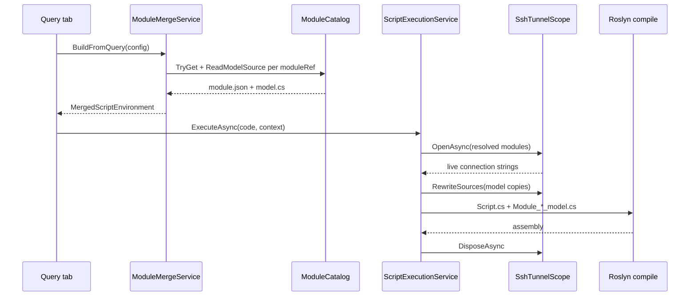

# EF Core Modules

ScratchpadSharp uses **EF Core modules** — reusable database connections with generated `DbContext` / entity models. Queries reference modules instead of embedding connection strings or scaffolded code.

## Create a database module

1. Open the **Modules** sidebar (left pane).
2. Click **+** or use **Add database** in the context menu.
3. Enter display name, provider, and connection (form or raw connection string).
4. **Test connection**, then **Save** — schema is scaffolded into `model.cs` under the module instance.

SQL Server can use an optional [SSH tunnel](ssh-tunnel.md) (DBeaver-style local port forward). SQLite does not. Database and SSH passwords are encrypted for the current OS user on this machine; see [SSH tunnel — What is stored](ssh-tunnel.md#what-is-stored).

Modules are stored at:

```
{LocalApplicationData}/ScratchpadSharp/modules/{instanceId}/
  module.json    # connection string without Password=; secrets as enc:v1: blobs
  model.cs
```

## Reference a module from a query

1. Select a query tab.
2. In the Modules sidebar, right-click an EF Core instance → **Add ref to query**.

The query `config.json` stores `moduleRefs` (instance ids). At compile/run, ScratchpadSharp merges module NuGet packages, usings, and `model.cs` into the query.

## Script API

Each module uses namespace `Modules.{NamespaceSegment}` from the instance display name:

```csharp
await using var db = new Modules.LocalSqlite.AppDbContext();
db.Blogs.Take(100).Dump();
```

Connection strings are baked into the generated `OnConfiguring` **without** `Password=`. At run time the live password (and SSH loopback host, if any) is patched into a copy of `model.cs`. There is no ambient `ConnectionString` in scripts.

Scaffolded models map each entity with `.ToTable("ExactTableName", "schema")` so pluralized `DbSet` names (e.g. `SalesTicketOrders`) still query the real SQL table (`SalesTicketOrder`). After upgrading ScratchpadSharp, use **Regenerate model** on existing modules so `model.cs` picks up this mapping.

## Sidebar actions

| Action | Description |
|--------|-------------|
| Refresh | Reload schema tree |
| Edit connection | Change provider / connection string |
| Regenerate model | Re-scaffold `model.cs` from live schema |
| Add / Remove ref | Toggle module on active query |
| Take (100) / Count | Open a new tab with generated LINQ, reuse cached EF packages, and auto-run |
| Delete | Remove module instance |

## Providers

SQLite and SQL Server are supported (same as before). Provider packages are pinned on the module instance, not on the query. SQL Server modules can enable an [SSH tunnel](ssh-tunnel.md).

## References window (F4)

The **Script** tab shows referenced modules (read-only) and per-query timeout. Add or remove module refs from the Modules sidebar.

---

## What is stored

Each module instance is a directory under `{LocalApplicationData}/ScratchpadSharp/modules/{instanceId}/`. The `instanceId` is a GUID (`N` format, no dashes) assigned at create time.

| File | Contents |
|---|---|
| `module.json` | `ModuleInstanceConfig`: display name, provider, connection string (no `Password=`), encrypted secrets, SSH tunnel settings, pinned NuGet packages, namespace segment |
| `model.cs` | Generated EF Core entities + single `AppDbContext` with baked connection string in `OnConfiguring` (also no password) |

Example `module.json`:

```json
{
  "id": "a1b2c3d4e5f6478990abcdef12345678",
  "typeId": "EfCore",
  "displayName": "Local SQLite",
  "namespaceSegment": "LocalSqlite",
  "providerId": "Sqlite",
  "connectionString": "Data Source=/home/user/data/app.db",
  "encryptedDatabasePassword": null,
  "sshTunnel": null,
  "usings": ["System", "Microsoft.EntityFrameworkCore"],
  "nuGetPackages": {
    "Microsoft.EntityFrameworkCore": "8.0.11",
    "Microsoft.EntityFrameworkCore.Sqlite": "8.0.11"
  }
}
```

SQL Server modules with SQL authentication store `encryptedDatabasePassword` as `enc:v1:...` and omit `Password=` from `connectionString`. Windows authentication (Integrated Security) does not use `encryptedDatabasePassword`. See [SSH tunnel — What is stored](ssh-tunnel.md#what-is-stored) for secret encryption details.

Query scripts store module references in `config.json`:

```json
{
  "moduleRefs": ["a1b2c3d4e5f6478990abcdef12345678"],
  "nuGetPackages": { },
  "usings": [ ]
}
```

`moduleRefs` holds instance ids only — not connection strings or model source.

## Model generation (scaffold)

On **Save** (create) or **Regenerate model**, `EfCoreModuleFactory` opens a live connection (optional SSH tunnel), reads schema via `IDbSchemaProvider`, and writes `model.cs` through `EfScaffoldGenerator`.

### Schema discovery

| Provider | Implementation | Source |
|---|---|---|
| SQLite | `SqliteSchemaProvider` | `sqlite_master` + `PRAGMA table_info` |
| SQL Server | `SqlServerSchemaProvider` | `INFORMATION_SCHEMA.TABLES` / `COLUMNS` + primary-key metadata |

### Tables included

A table is scaffolded only when all of the following hold:

- Not a view (`IsView == false`)
- Name does not start with `__` (skips `__EFMigrationsHistory` and similar)
- Name does not start with `sqlite_`
- Has at least one primary-key column

If no tables qualify, `model.cs` contains `// No tables to scaffold.`

### Generated shape

For each table:

- **Entity class** — PascalCase from the table name (`SalesTicketOrder` → class `SalesTicketOrder`)
- **DbSet** — entity name + `s` (`SalesTicketOrders`)
- **Table mapping** — `entity.ToTable("SalesTicketOrder", "dbo")` so the pluralized DbSet still targets the real table
- **Primary key** — `HasKey` on a single column or composite `{ Col1, Col2 }`
- **Column rename** — `HasColumnName("original_name")` when the PascalCase property differs from the SQL name

`AppDbContext` uses `OnConfiguring` with the provider extension (`UseSqlite` / `UseSqlServer`) and the connection string from `module.json` (password stripped). There is no `AddDbContext` DI — scripts construct `new AppDbContext()` directly.

### CLR type mapping

`EfScaffoldGenerator.MapClrType` maps common SQL types to C# (`int`, `long`, `decimal`, `bool`, `Guid`, `DateTime`, `DateTimeOffset`, `TimeSpan`, `byte[]`, `string`). Unknown types fall back to `string`. Nullable columns get `?` on value types; `string` and `byte[]` are reference-like and only get `?` when nullable.

## Namespace and naming

The C# namespace is `Modules.{NamespaceSegment}` where `NamespaceSegment` comes from the display name:

1. Non-word characters → `_`
2. Split on `_`, PascalCase each part (`local sqlite` → `LocalSqlite`)
3. Leading digit → prefix `T`

Scripts reference `Modules.LocalSqlite.AppDbContext` and entity types in the same namespace. The sidebar **Take (100)** / **Count** actions generate ephemeral scripts using `db.Set<T>()` when the DbSet name is not needed.

## Query integration (merge + compile)

When a tab loads, saves refs, or resolves packages, `ProjectService.RefreshMergedEnvironmentAsync` calls `ModuleMergeService.BuildFromQuery`:

1. Resolve each id in `config.moduleRefs` via `ModuleCatalog.TryGet`
2. Read `model.cs` from disk; fail if missing
3. Rename in compilation to `Module_{NamespaceSegment}_model.cs`
4. Prepend any module `usings` not already in the source (`EnsureModuleUsings`)
5. Merge module `usings` and `NuGetPackages` into the query environment

NuGet version conflicts between the query and a referenced module throw `InvalidOperationException` at merge time.

Roslyn sees module sources as additional syntax trees alongside `Script.cs`. IntelliSense and compile share the same merged environment (`ProjectContext.MergedEnvironment`).

At run time, `ScriptExecutionService`:

1. Opens `SshTunnelScope` for all referenced modules (unlock secrets, optional tunnels)
2. Rewrites module source **copies** with the live connection string (`SshTunnelScope.RewriteSources`)
3. Compiles `Script.cs` + rewritten module trees
4. Loads into a collectible `ScriptAssemblyLoadContext` with EF Core assemblies preloaded (`Microsoft.EntityFrameworkCore`, provider package, `Microsoft.Data.SqlClient` on SQL Server)
5. Disposes tunnels when the script finishes, is cancelled, or fails to compile

The on-disk `model.cs` is never modified during script execution.



## Connection strings at run time

| Stage | Connection string |
|---|---|
| On disk (`module.json`, `model.cs`) | Provider-specific string **without** `Password=` |
| After `ModuleSecrets.UnlockAsync` | Password injected for SQL auth (or prompt if blob unreadable) |
| After `SshTunnelSession.OpenIfNeededAsync` | Loopback host/port when SSH is enabled (see [SSH tunnel](ssh-tunnel.md)) |
| In compiled `OnConfiguring` | Patched copy via `EfScaffoldGenerator.TryReplaceBakedConnectionString` |

`TryReplaceBakedConnectionString` does a literal replace of the quoted baked string in `OnConfiguring`. If you hand-edit `model.cs` and the baked string no longer matches `module.json`, rewrite fails — use **Regenerate model**.

**Edit connection** updates `module.json` and, when only the connection string changed, rewrites the baked string in the existing `model.cs` without a full re-scaffold. Provider changes re-apply NuGet packages. `namespaceSegment` is fixed at create time (renaming the display name does not rename `Modules.*`).

## NuGet packages

EF Core packages are pinned on the **module instance**, not on individual queries:

| Package | Version (current) |
|---|---|
| `Microsoft.EntityFrameworkCore` | `8.0.11` |
| `Microsoft.EntityFrameworkCore.Sqlite` | `8.0.11` (SQLite modules) |
| `Microsoft.EntityFrameworkCore.SqlServer` | `8.0.11` (SQL Server modules) |

`DatabaseProviderCatalog.ApplyModulePackages` sets these when a module is created or the provider changes. Referencing a module pulls its packages into the query’s resolved graph automatically. `ProjectService` caches the resolved graph (and hydrated assembly paths) by package set, so Take / Count and later refs of the same provider skip NuGet restore.

## Sidebar operations (implementation)

| UI action | Code path |
|---|---|
| Create module | `EfCoreModuleFactory.CreateInstanceAsync` → schema + scaffold + `ModuleCatalog.Save` |
| Edit connection | `EfCoreModuleFactory.UpdateConnectionAsync` |
| Refresh schema tree | `EfCoreModuleFactory.GetSchemaAsync` |
| Regenerate model | `EfCoreModuleFactory.RegenerateModelAsync` |
| Test connection | `EfCoreModuleFactory.TestConnectionAsync` |
| Take / Count | `BuildTakeScript` / `BuildCountScript` → new tab (code shown immediately) → cached package graph → auto-run |
| Add / Remove ref | `ProjectService.AddModuleRefAsync` / `RemoveModuleRefAsync` |

Schema refresh and scaffold operations open a short-lived live connection (with optional SSH). They do not keep a pooled connection open.

## Types

| Type | Role |
|---|---|
| `ModuleInstanceConfig` | Persisted module metadata (`ScratchpadSharp.Shared`) |
| `ModuleCatalog` | Load/save/list instances under `AppPaths.ModulesDirectory` |
| `EfCoreModuleFactory` | Create, update, test, scaffold, ephemeral LINQ scripts |
| `EfScaffoldGenerator` | `model.cs` text from `DbSchemaSnapshot` |
| `DbSchemaProviderFactory` | Provider → `SqliteSchemaProvider` / `SqlServerSchemaProvider` |
| `ModuleMergeService` | Merge refs, usings, packages, and sources into `MergedScriptEnvironment` |
| `ModuleSecrets` | Strip/protect/unlock database and SSH secrets |
| `SshTunnelScope` | Run-time connection rewrite for all referenced modules |
| `ScriptExecutionService` | Tunnel scope + Roslyn compile + isolated execute |

UI: `ModulesSidebarViewModel`, `DatabaseConnectionWindow` / `DatabaseConnectionViewModel`.

## Adding another database provider

1. Add a `DatabaseProviderInfo` row in `DatabaseProviderCatalog` (`EfProviderPackageId`, `UseExtensionMethod`, template, optional `SupportsSshTunnel`).
2. Implement `IDbSchemaProvider` (connection test + `GetSchemaAsync`).
3. Register it in `DbSchemaProviderFactory.Create`.
4. Add connection-string form fields in `ConnectionStringBuilderFactory` if the provider needs a curated dialog.

Scaffold and script merge are provider-agnostic once schema snapshots and `UseSqlite`/`UseSqlServer`-style extension method names are wired.

## Limits

- Views and tables without primary keys are not scaffolded.
- No EF migrations, `DbContext` pooling, or ambient `IDbContextFactory` — one `AppDbContext` per `new`.
- Composite and surrogate keys are supported; foreign keys and navigation properties are not generated.
- Only SQLite and SQL Server are selectable today; catalog entries for PostgreSQL/MySQL exist for future package cleanup only.
- Headless `--headless run --module <id>` sets `moduleRefs` to a single id; secret re-prompt requires the GUI **Edit connection** dialog.
- Module secrets are bound to the current OS user on this machine (see [SSH tunnel — What is stored](ssh-tunnel.md#what-is-stored)).
