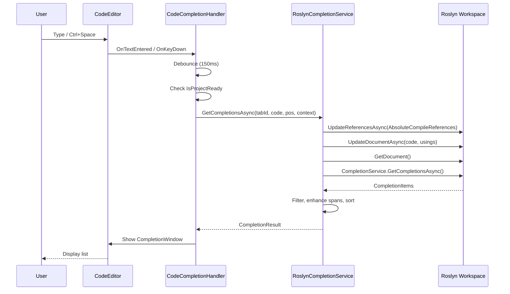

# IntelliSense (Code Completion) Workflow

This document describes the intended IntelliSense pipeline in ScratchpadSharp: UI triggers, Roslyn workspace sync, and result presentation.

## Design Principles

1. **Editor and Roslyn must stay in sync** — every completion request pushes the current editor text (plus hidden usings) into the Roslyn document *before* querying completions. Position adjustment for hidden usings only works when the document actually contains those usings.
2. **References come from hydrated runtime state** — use `ProjectContext.AbsoluteCompileReferences` (absolute DLL paths after `HydratePaths` / `UnifyReferenceLists`), not raw `Config.NuGetPackages`. Local DLLs also pull sibling copy-local assemblies and `{name}.deps.json` package graphs into this list (same identity set as `AbsoluteRuntimeReferences`, `ref/` vs `lib/` paths). After adding/removing packages, `ProjectService` refreshes this list and updates the Roslyn workspace; completion re-syncs on each request. `GetReferencesWithPackages` replaces a TPA default when an extra path has the same assembly simple name.
3. **Same pipeline as signature help** — `RoslynCompletionService` and `SignatureProvider` follow the same workspace preparation order: check ready → sync references → sync document → adjust position → query Roslyn.

## 1. Triggering Mechanism (`CodeCompletionHandler.cs`)

Completion is initiated from the `CodeEditor`.

### Trigger Events

- **Text Input (`OnTextEntered`)**:
  - Updates `lastTextChange` before evaluating the trigger (so the first typed character and continuous input behave consistently).
  - `ShouldTriggerCompletion` rules:
    - **Always**: `.`, `<`
    - **Conditional**: letters, digits, `_` when typed within 2 seconds of the previous edit
    - **Re-trigger** (window already open): only `.` or `<`
- **Keyboard Shortcut (`HandleKeyDown`)**:
  - **Ctrl+Space**: force completion

### Request Flow

1. **Guard**: Skip if the editor is unavailable or `MainWindowViewModel.IsProjectReady` is false (Roslyn project not initialized yet).
2. **Debouncing**: `ShowCompletionWindowAsync` waits `150ms` (`CompletionDebounceMs`).
3. **Context collection**:
   - Code: `CodeEditor.Document.Text`
   - Caret: `CodeEditor.CaretOffset`
   - Project: `MainWindowViewModel.ProjectContext` (`Config.Usings`, `AbsoluteCompileReferences`, etc.)
4. **Service call**: `IRoslynCompletionService.GetCompletionsAsync(tabId, code, position, context)`.

## 2. Roslyn Processing (`RoslynCompletionService.cs`)

### Step 1: Workspace Preparation (order matters)

1. **Initialization check** — return empty if `RoslynWorkspaceService` is not ready.
2. **Context check** — return empty if `ProjectContext` is null.
3. **Sync references** — always call `UpdateReferencesAsync(tabId, context.AbsoluteCompileReferences)`. An empty list resets to default BCL references only. Skipping when the list is unchanged is handled inside `RoslynWorkspaceService` via `LastAppliedPackages`.
4. **Sync document** — `UpdateDocumentAsync` wraps editor code in the same `__ScriptRunner.__Execute()` shell used at compile time (via `ScriptDocumentBuilder`), with config usings prepended. This puts script statements and `static` local functions in a method body so Roslyn can resolve them.
5. **Position adjustment** — `ScriptDocumentBuilder.ToDocumentPosition` maps the editor caret into the wrapped document coordinate space (accounts for hidden usings + class wrapper).

### Step 2: Fetching Completions

- Obtain `CompletionService` from the synced `Document`.
- Derive `CompletionTrigger` from the character before the caret (`.`, `(`, `[`, `<`, whitespace) or use `CompletionTrigger.Invoke` for manual invocation.
- Call `completionService.GetCompletionsAsync(document, adjustedPosition, trigger, ...)`.

### Step 3: Filtering & Enhancement

1. **Keyword filtering** — drop items tagged `WellKnownTags.Keyword`. In member-access context (after `.`), also drop `WellKnownTags.Snippet`.
2. **Namespace visibility** — namespace items get a priority boost and are preserved when capping results at 1000 items (otherwise BCL types crowd them out).
3. **Using-directive context** — leading `using ...` lines in the editor (including incomplete ones without `;`) are placed in the document usings section, not inside `__Execute()`, so namespace completion works while typing `using System.Net`.
4. **Enhancement (`EnhanceCompletionItems`)**:
   - Map to `EnhancedCompletionItem`
   - **Documentation** — loaded lazily on selection via `GetCompletionDescriptionAsync` (not during the initial list build)
   - **Kind** — from Roslyn tags
   - **CompletionSpan** — adjust `item.Span` back to editor coordinates (subtract hidden-usings offset)
   - **Priority** — `MatchPriority`, tags (locals > members > types), etc.
5. **Sorting (`ApplyPrioritySort`)** — `IsRecommended` → `Priority` → `SortText` → `DisplayText`.

### Step 4: Result Return

- `CompletionResult` with up to `MaxCompletionItems` (1000) items.
- `IsIncomplete` when Roslyn returns more than the cap.

### Reference Metadata

- BCL assemblies use XML documentation via `BclXmlResolver`.
- NuGet/local DLLs use a sibling `.xml` file next to the assembly when present.

## 3. UI Presentation (`CodeCompletionHandler.cs`)

On the UI thread after the async service call:

1. Create `CompletionWindow` (min 450×250).
2. Populate `RoslynCompletionData` from result items.
3. Set `StartOffset` from the first item's `CompletionSpan.Start` (fallback: scan backward for identifier characters).
4. `completionWindow.Show()`.

Empty results are silent (no popup); check debug output tagged `[Completion]` or `[RoslynWorkspace]` when diagnosing missing items.

## 4. Reference Changes (NuGet / local assemblies)

When packages or references change via `ProjectService`:

```
Config change → ResolveAndSaveAsync → Manifest update → HydratePaths
    → AbsoluteCompileReferences rebuilt → UpdateReferencesAsync (immediate)
```

The next completion request runs the same `UpdateReferencesAsync` again (no-op if unchanged), then syncs the document. Users do not need to restart the editor after installing a package.

## Summary Diagram


