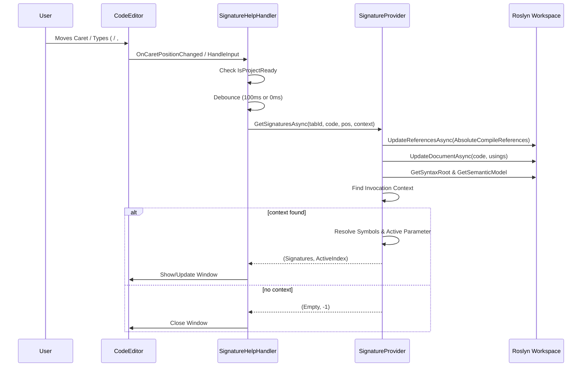

# Method Signature Help Workflow

This document details the internal working mechanism of the Method Signature Help feature in ScratchpadSharp, which displays parameter information and documentation when typing method calls.

## 1. Triggering Mechanism (`SignatureHelpHandler.cs`)

The signature help process is managed by `SignatureHelpHandler` and primarily relies on **caret position polling** (`OnCaretPositionChanged`) to maintain state, ensuring robustness against editing operations like deletion and pasting.

### Trigger Events

- **Caret Movement (`OnCaretPositionChanged`)**:
  - Every time the caret moves, a request is scheduled (debounced by `100ms`).
  - This checks if the caret is currently inside a valid method invocation context.
  - If valid → shows or updates the window.
  - If invalid → closes the window.

- **Explicit Triggers (`HandleInput`)**:
  - `(` and `,`: triggers an **immediate** update (debounce `0ms`) to provide instant feedback when typing arguments.

- **Keyboard Interaction (`HandleKeyDown` / `SignatureHelpWindow`)**:
  - **Escape**: closes the signature help window.
  - Overload navigation is **not** bound to ↑/↓ keys. Overloads are chosen automatically (see §3); the popup `ListBox` allows manual selection by click.

### Request Flow

1. **Guard**: skip if the editor is unavailable or `MainWindowViewModel.IsProjectReady` is false.
2. **Debouncing**:
   - Normal caret movement: `100ms` wait.
   - Explicit triggers (`(`, `,`): `0ms` wait.
3. **Context Collection**:
   - Current code: `CodeEditor.Document.Text`
   - Caret position: `CodeEditor.CaretOffset`
   - Project: `MainWindowViewModel.ProjectContext` (`Config.Usings`, `AbsoluteCompileReferences`, etc.)
4. **Service Call**: `ISignatureProvider.GetSignaturesAsync(tabId, code, position, context)`.
5. **State Logic (`UpdateOrShowSignatureHelpAsync`)**:
   - If signatures are returned: show window (if hidden) or update the ViewModel.
   - If signatures are empty: close window.

## 2. Roslyn Processing (`SignatureProvider.cs`)

The core code analysis logic resides in `SignatureProvider`. It follows the same workspace preparation order as code completion (see [intellisense-workflow.md](intellisense-workflow.md)).

### Step 1: Workspace Preparation

1. **Initialization check** — return empty if `RoslynWorkspaceService` is not ready.
2. **Context check** — return empty if `ProjectContext` is null.
3. **Sync references** — `UpdateReferencesAsync(tabId, context.AbsoluteCompileReferences)`.
4. **Sync document** — `UpdateDocumentAsync(tabId, code, context.Config.Usings)` with the same `__ScriptRunner.__Execute()` wrapper used at compile time.
5. **Position adjustment** — map the editor caret into the wrapped document coordinate space.

### Step 2: Context Analysis (`FindInvocationContext`)

- **Node Finding**: uses Roslyn's syntax tree (`GetSyntaxRootAsync`) to find the syntax node at the caret position.
- **Invocation Identification**: walks up the syntax tree to find a compatible container:
  - `InvocationExpressionSyntax` (method calls)
  - `ObjectCreationExpressionSyntax` (constructor calls via `new`)
  - `BaseObjectCreationExpressionSyntax`
- **Validation**: verifies that the caret is strictly within the method's parentheses arguments (`IsPositionInContext`).

### Step 3: Symbol Resolution

- **Semantic Model**: uses `GetSemanticModelAsync` to obtain semantic information.
- **Symbol Lookup**:
  - For methods: `semanticModel.GetMemberGroup` returns all overloads.
  - For constructors: `semanticModel.GetTypeInfo` identifies the type, then retrieves all `public` constructors.
- **Filtering**: distinct symbols are collected into a list of `ISymbol`.

### Step 4: Signature Extraction (`ExtractSignatures`)

- **MethodSignature Creation**: converts Roslyn symbols into the internal `MethodSignature` model.
- **Documentation Parsing**:
  - Retrieves XML documentation using `method.GetDocumentationCommentXml()`.
  - Parses `
`, `<param>`, and `<returns>` tags to provide rich descriptions.
- **Parameter Mapping**: maps Roslyn parameters to `ParameterSignature` (name, type, default value, `params`, optional).

### Step 5: Parameter Tracking (`CalculateParameterPosition`)

- Analyzes the `ArgumentList` syntax.
- Compares the caret position against the spans of existing arguments and commas.
- Determines `activeParam`: the index of the parameter the user is currently typing.
- Handles edge cases like being after the last comma or on an empty argument list.

## 3. UI Presentation (`SignatureHelpViewModel.cs`)

Back on the UI thread, the results are presented via `SignatureHelpWindow` and `SignatureHelpPopup`.

### ViewModel Logic

1. **Overload Selection (`SelectBestMatchingOverload`)**:
   - Automatically selects the best overload based on the number of arguments typed so far.
   - Intelligently handles `params` arrays (counting them as a match for any number of excess arguments).
   - Re-runs when the active parameter index changes.
2. **Parameter Highlighting**:
   - `UpdateParameterHighlights` sets `IsHighlighted` on the parameter matching the current argument index.
   - This creates the bold effect on the active parameter in the UI.

### View (`SignatureHelpPopup.axaml`)

- `ListBox` bound to all overloads; `SelectedSignature` can be changed by clicking an item.
- Displays return type, name, parameters (active parameter bolded), and inline summary.
- Shows per-parameter documentation for the best-matching overload (`IsBestMatch`).

## Summary Diagram

