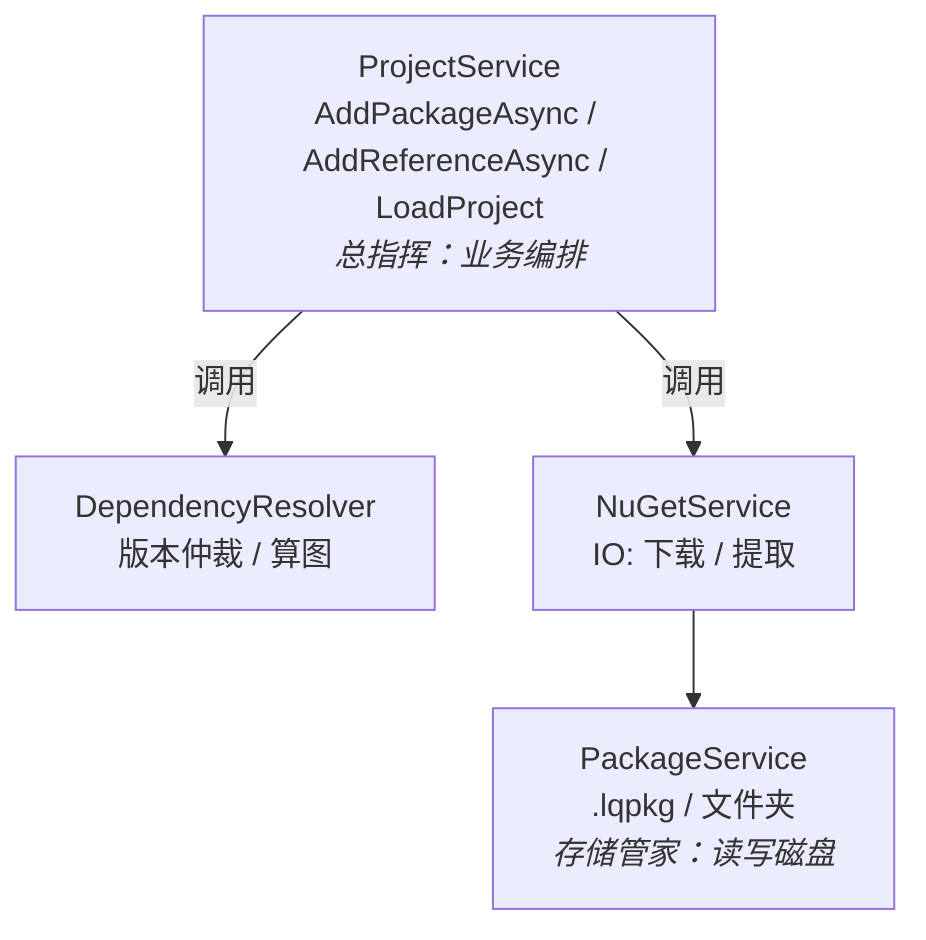
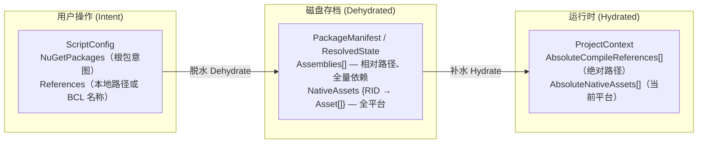
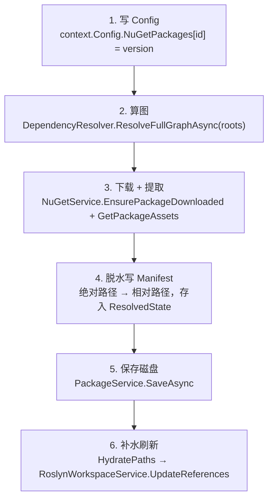
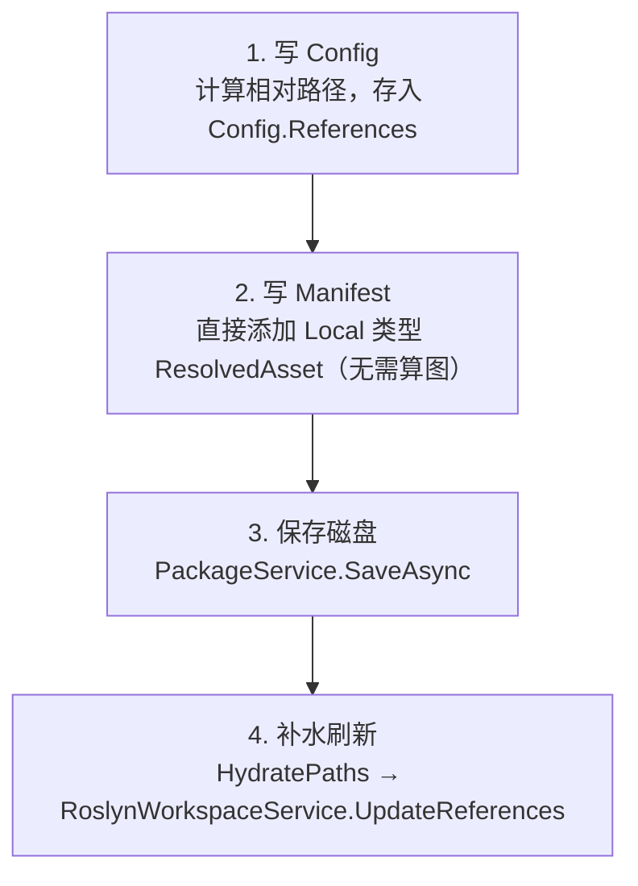
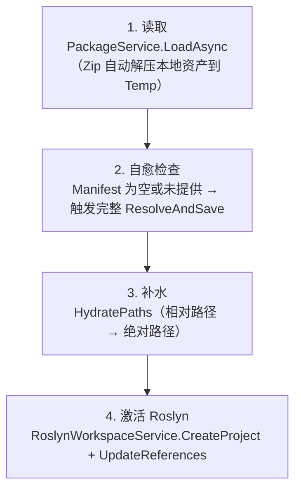

# Reference Management

## 架构概览

引用管理由四个核心组件构成，各司其职：



---

## 组件职责

### `NuGetService`

纯物理 IO，不含业务逻辑。


| 方法                             | 职责                                                             |
| ------------------------------ | -------------------------------------------------------------- |
| `GetPackageDependenciesAsync`  | 从 NuGet 源查询某个包的直接依赖元数据，供 DependencyResolver 构图                 |
| `EnsurePackageDownloadedAsync` | 确保包已下载到全局缓存（`~/.nuget/packages`），已存在则直接返回路径                    |
| `GetPackageAssetsAsync`        | 从包目录智能提取编译用 DLL（优先 `ref/`，降级 `lib/`）及各平台 Native 库（`runtimes/`） |


### `DependencyResolver`

纯算法，不碰文件。

接收根包列表 → 递归抓取所有传递依赖元数据 → 交给 NuGet 内置 `PackageResolver` 仲裁版本冲突 → 输出扁平、去重的确切版本清单。

### `PackageService`

纯数据 IO，只处理 `.lqpkg`（Zip）和文件夹两种格式的读写。

- **保存**：将 `ScriptPackage`（内存对象）序列化为 `manifest.json` + `config.json` + `code.cs`
- **加载**：反序列化文件，对 `.lqpkg` 中的本地引用额外解压到临时目录，并更新 `RootPath` 指向该临时目录

### `ProjectService`

业务编排，串联上述所有组件。管理项目的内存状态（`ProjectContext`）和生命周期。

---

## 数据模型的三种形态



**脱水（Dehydrate）**：将绝对路径剥离为相对路径存入 Manifest，NuGet 资产存包内相对路径（如 `lib/net8.0/Newtonsoft.Json.dll`），Local 资产存相对于项目根的路径，路径分隔符统一用 `/`。

**补水（Hydrate）**：

- NuGet 资产：`globalPackagesFolder / id.toLower() / version.toLower() / relPath`
- Local 资产：`EffectiveRootPath / relPath`

Native 资产按当前平台 RID（`RuntimeInformation.RuntimeIdentifier`）从字典中过滤后补水到 `AbsoluteNativeAssets`。

---

## 核心工作流

### 1. 添加 NuGet 包（`AddPackageAsync`）



> Manifest 在每次 Resolve 时**全量重建**（先 `Clear()`），保证无残留脏数据。

### 2. 添加本地引用（`AddReferenceAsync`）



### 3. 加载项目（`LoadProjectAsync`）



### 4. 脚本执行（`ScriptExecutionService.ExecuteAsync`）

只需接收 `code` + `ProjectContext`，直接使用：

- `AbsoluteCompileReferences` → Roslyn 编译引用
- `AbsoluteNativeAssets` → `ScriptAssemblyLoadContext` 的额外探针路径

---

## 数据存储格式

### 文件夹结构（开发模式）

```
project/
├── code.cs
├── config.json
├── last_run.txt
└── .lqpkg/
    └── manifest.json
```

### .lqpkg（发布模式）

标准 Zip 压缩包，内含同名文件。本地引用的 DLL 随包打入 Zip，加载时解压到临时目录。

### manifest.json 片段

```json
{
  "resolvedState": {
    "assemblies": [
      {
        "origin": "NuGet",
        "id": "Newtonsoft.Json",
        "version": "13.0.3",
        "relativePath": "lib/net6.0/Newtonsoft.Json.dll"
      },
      {
        "origin": "Local",
        "id": "MyLib.dll",
        "relativePath": "libs/MyLib.dll"
      }
    ],
    "nativeAssets": {
      "linux-x64": [
        {
          "origin": "NuGet",
          "id": "SQLitePCLRaw.lib.e_sqlite3",
          "version": "2.1.6",
          "relativePath": "runtimes/linux-x64/native/libe_sqlite3.so"
        }
      ],
      "win-x64": [ "..." ]
    }
  }
}
```

---

## `ScriptConfig.References` 说明

`References` 字段同时存储两类内容：

- **BCL 程序集名**（如 `"System.Runtime"`）：编译时由 `MetadataReferenceProvider` 通过 `Assembly.Load()` 加载，**不会**写入 Manifest
- **用户本地文件路径**（如 `"libs/MyLib.dll"`）：有文件扩展名或路径分隔符，会写入 Manifest 作为 `Local` 资产

两者在 `ResolveAndSaveAsync` 中通过是否包含路径分隔符或 `.dll` 扩展名进行区分。