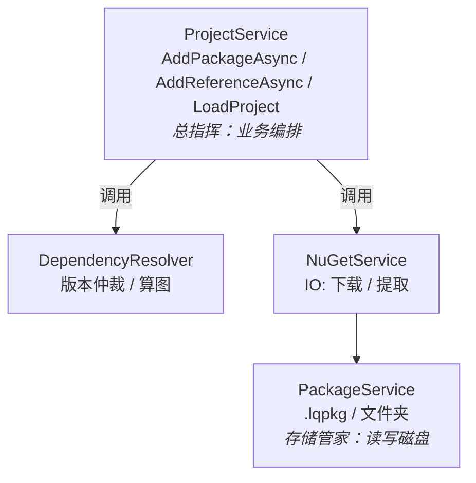
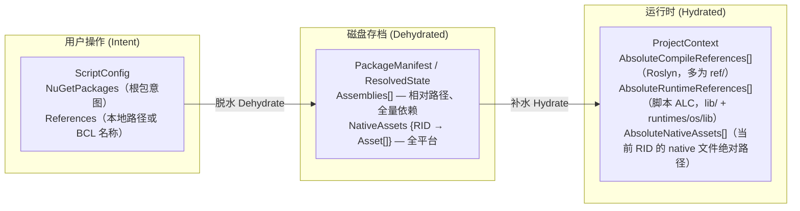
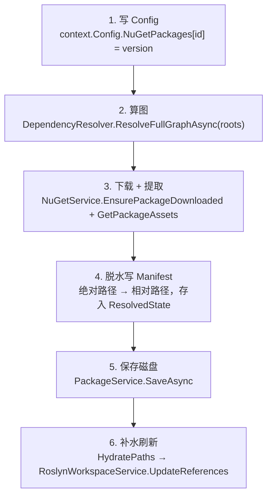
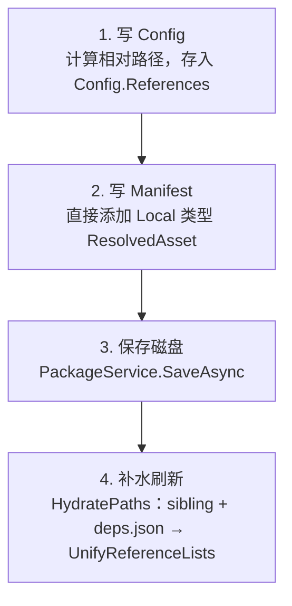
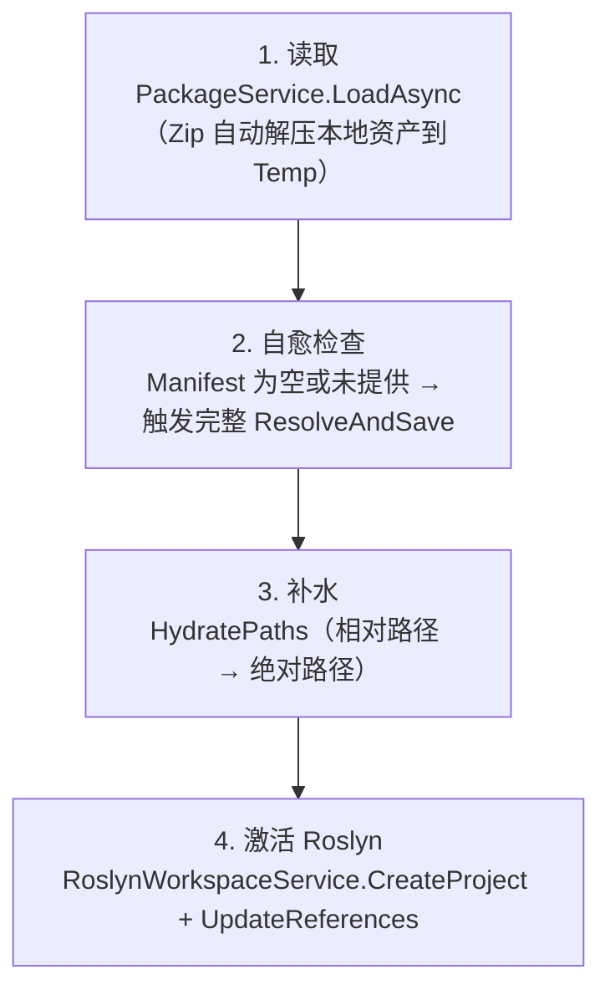
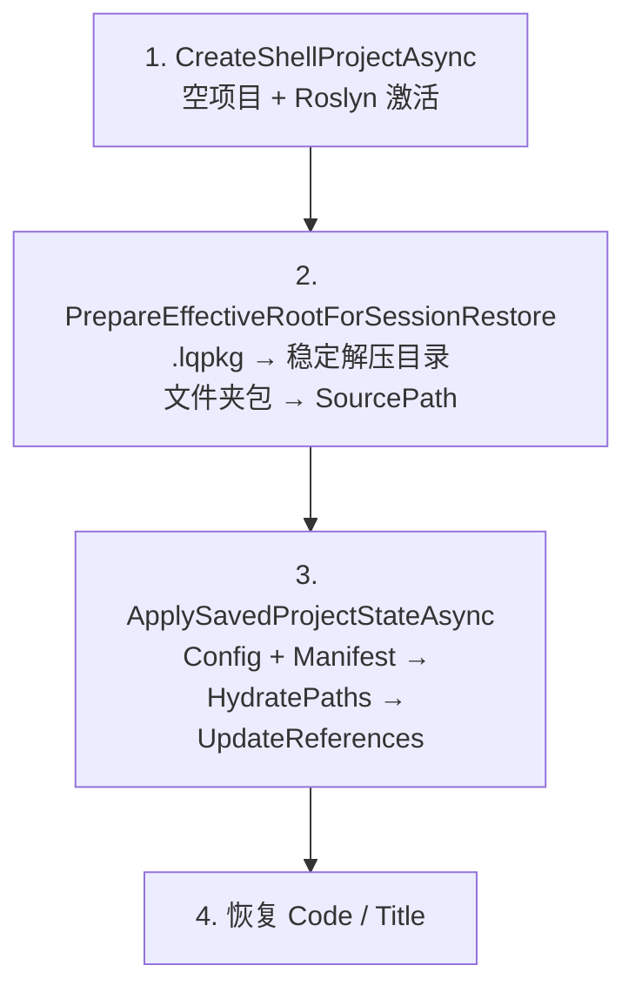

# Reference Management

## 架构概览

引用管理由四个核心组件构成，各司其职：



---

## 组件职责

### `NuGetService`

纯物理 IO，不含业务逻辑。


| 方法                             | 职责                                                             |
| ------------------------------ | -------------------------------------------------------------- |
| `GetPackageDependenciesAsync`  | 从 NuGet 源查询某个包的直接依赖元数据，供 DependencyResolver 构图                 |
| `EnsurePackageDownloadedAsync` | 确保包已下载到全局缓存（`~/.nuget/packages`），已存在则直接返回路径                    |
| `GetPackageAssetsAsync`        | 从包目录提取：`ref/`（Roslyn 编译）、`lib/` + `runtimes/{os}/lib/`（运行时实现程序集）、`runtimes/{rid}/native`（Native 库） |


### `DependencyResolver`

纯算法，不碰文件。

接收根包列表 → 递归抓取所有传递依赖元数据 → 交给 NuGet 内置 `PackageResolver` 仲裁版本冲突 → 输出扁平、去重的确切版本清单。

### `PackageService`

纯数据 IO，只处理 `.lqpkg`（Zip）和文件夹两种格式的读写。

- **保存**：将 `ScriptPackage`（内存对象）序列化为 `manifest.json` + `config.json` + `code.cs`
- **加载**：反序列化文件，对 `.lqpkg` 中的本地引用额外解压到临时目录，并更新 `RootPath` 指向该临时目录

### `ProjectService`

业务编排，串联上述所有组件。管理项目的内存状态（`ProjectContext`）和生命周期。

---

## 数据模型的三种形态



**脱水（Dehydrate）**：将绝对路径剥离为相对路径存入 Manifest，NuGet 资产存包内相对路径（如 `lib/net8.0/Newtonsoft.Json.dll`），Local 资产存相对于项目根的路径，路径分隔符统一用 `/`。

**补水（Hydrate）**（`HydratePaths` → `UnifyReferenceLists`）：

- NuGet：对每个包调用 `GetPackageAssetsAsync`，经 `AddResolvedAssembly` 同时写入编译与运行时列表；Manifest 中的 `ref/` 路径用于编译，实现 DLL 用于运行时
- Local：`EffectiveRootPath / relPath`（已是绝对路径则直接用）→ `AddResolvedAssembly`；再读 PE 引用，把**同目录存在的** sibling DLL 一并加入
- 每个已加入的本地 DLL 若旁边有 `{name}.deps.json`，解析 `runtime` 与当前 RID 匹配的 `runtimeTargets`（managed → 同一套程序集身份；`native` → `AbsoluteNativeAssets`）。class library 默认不拷贝 PackageReference，依赖从 `~/.nuget/packages/{libraries.path}/` 解析
- 最后按程序集**简单名**折叠：`SelectPreferredCompileAssemblies`（优先 `ref/`）与 `SelectPreferredRuntimeAssemblies`（优先 `lib/` / `runtimes/*/lib`）。两边名字集合一致，只是路径不同。Roslyn `GetReferencesWithPackages` 对同名程序集用补水路径覆盖宿主 TPA

Native 资产按当前 RID 从 Manifest `NativeAssets` 过滤，再并入 deps.json 的 native `runtimeTargets`。脚本 ALC 把这些路径当探针，并从 NuGet 包根探测 `runtimes/{rid}/native/`，同时把每个运行时 DLL 所在目录加入探测路径。

---

## 核心工作流

### 1. 添加 NuGet 包（`AddPackageAsync`）



> Manifest 在每次 Resolve 时**全量重建**（先 `Clear()`），保证无残留脏数据。

### 2. 添加本地引用（`AddReferenceAsync`）



本地 DLL **不算 NuGet 图**。补水时会读取程序集引用，把**同目录下存在的**被引用 DLL 一并加入编译/运行时列表（copy-local / ProjectReference）。

同时读取旁边的 `{name}.deps.json`（含 sibling 上的 deps），把 `runtime` 与当前 RID 的 `runtimeTargets` 补进**同一套程序集身份**：

- **编译 / 智能感知**：`PreferCompileAssemblyPath`（有 `ref/` 则用元数据程序集）
- **运行时**：`EnsureImplementationAssemblyPath`（`lib/` / `runtimes/*/lib`）

两边按程序集简单名折叠，集合一致，只是路径不同。Roslyn 对同名程序集用 deps/NuGet 路径覆盖宿主 TPA，避免补全一套、执行另一套。native `runtimeTargets` 进入 `AbsoluteNativeAssets`。

未出现在同目录、也未写入 deps.json 的依赖仍需用户自行 `AddPackage` / `AddReference`。

### 3. 加载项目（`LoadProjectAsync`）



### 4. 脚本执行（`ScriptExecutionService.ExecuteAsync`）

只需接收 `code` + `ProjectContext`，直接使用：

- `AbsoluteCompileReferences` → Roslyn 编译引用（`ref/` 元数据；同名覆盖 TPA）
- `AbsoluteRuntimeReferences` → `ScriptAssemblyLoadContext` 预加载与程序集解析（实现 DLL，非 `ref/`）
- `AbsoluteNativeAssets` → native 文件路径 + 包根目录探针（`runtimes/{rid}/native/`）

ALC 还会：把每个运行时 DLL 所在目录加入探测路径（同目录 sibling）；对非 NuGet 布局且存在 `{name}.deps.json` 的 DLL 构造 `AssemblyDependencyResolver`（有 runtimeconfig 探测路径时有效；主路径仍是补水进 `AbsoluteRuntimeReferences` 的 deps 图）。

### 5. Session 恢复（`RestoreFromSessionAsync`）

应用退出时将会话写入 `~/.local/share/ScratchpadSharp/session.json`（见 [session-restore.md](session-restore.md)）。每个标签页保存 `Config`（意图）和 `Manifest`（已解析资产），启动时优先走快速路径，避免重复 NuGet Resolve。



**未保存标签页**（无 `SourcePath`）：代码、NuGet 包、本地引用全部来自 session 文件，不依赖磁盘上的项目文件。NuGet 引用通过 Manifest 补水；本地 DLL 若为绝对路径则可直接解析。

**`.lqpkg` 内嵌 Local 资产**：Manifest 中路径相对于 `{Temp}/ScratchpadSharp/Packages/{包名}/`。恢复时必须先 `PrepareEffectiveRootForSessionRestoreAsync`，不能用随机 shell 临时目录，否则 Local 引用会丢失。

若 session 仅有 `Config`、无 `Manifest`（旧格式），回退为 `RestoreConfigAsync`（完整 `ResolveAndSaveAsync`）。

---

## 数据存储格式

### 文件夹结构（开发模式）

```
project/
├── code.cs
├── config.json
├── last_run.txt
└── .lqpkg/
    └── manifest.json
```

### .lqpkg（发布模式）

标准 Zip，内含 `manifest.json`、`code.cs`、`config.json`（及可选 `last_run.txt`）。**当前 `SaveAsZipAsync` / `PackAsync` 不会把本地 DLL 打进 Zip。** `LoadAsync` 若在 Zip 里找到 Manifest 所记的 Local 条目，会解压到 `{Temp}/ScratchpadSharp/Packages/{包名}/` 并设置 `RootPath`。要分发带本地引用的包，需自行把 DLL 放进 Zip 或改用文件夹开发模式（DLL 留在项目目录）。

### manifest.json 片段

```json
{
  "resolvedState": {
    "assemblies": [
      {
        "origin": "NuGet",
        "id": "Newtonsoft.Json",
        "version": "13.0.3",
        "relativePath": "lib/net6.0/Newtonsoft.Json.dll"
      },
      {
        "origin": "Local",
        "id": "MyLib.dll",
        "relativePath": "libs/MyLib.dll"
      }
    ],
    "nativeAssets": {
      "linux-x64": [
        {
          "origin": "NuGet",
          "id": "SQLitePCLRaw.lib.e_sqlite3",
          "version": "2.1.6",
          "relativePath": "runtimes/linux-x64/native/libe_sqlite3.so"
        }
      ],
      "win-x64": [ "..." ]
    }
  }
}
```

---

## `ScriptConfig.References` 说明

`References` 仅用于 **用户本地 DLL 路径**（如 `"libs/MyLib.dll"`，或包含路径分隔符的相对路径）。条目会写入 Manifest 作为 `Local` 资产。加载/补水时不会把 deps.json 里的 NuGet 包写回 `Config.NuGetPackages`；那些包只出现在补水后的编译/运行时列表里。

共享框架（BCL）不由此字段配置：`MetadataReferenceProvider.GetDefaultReferences()` 从运行时 `TRUSTED_PLATFORM_ASSEMBLIES` 加载完整 TPA 列表；无 TPA 时回退到共享框架目录或最小类型集。脚本额外引用与 TPA **同名**时，`GetReferencesWithPackages` 用补水路径覆盖 TPA 条目。