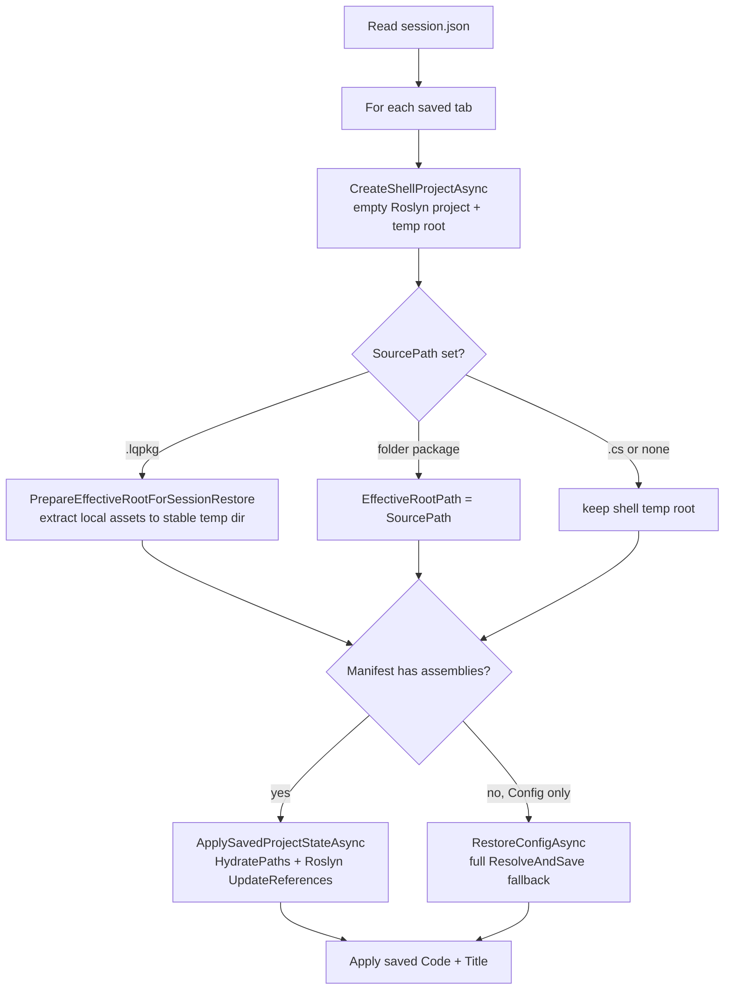

# Session Restore

ScratchpadSharp can persist editor state across restarts: open tabs, unsaved code, references, and the selected tab.

## Configuration

In `appsettings.json`:

```json
{
  "Application": {
    "RestoreSessionOnStartup": true
  }
}
```

| Option | Default | Description |
|--------|---------|-------------|
| `RestoreSessionOnStartup` | `true` | Save session on exit and restore on next launch |

Disable to always start with a single empty tab and skip writing session data.

Environment variable override (same as other `appsettings` keys):

```bash
SCRATCHPAD_Application__RestoreSessionOnStartup=false
```

## Session file

State is stored separately from `appsettings.json`:

```
~/.local/share/ScratchpadSharp/session.json   # Linux (LocalApplicationData)
```

Each exit (window close) overwrites this file when `RestoreSessionOnStartup` is `true`.

## What is saved per tab

| Field | Purpose |
|-------|---------|
| `SourcePath` | Path to `.cs`, `.lqpkg`, or folder package; `null` for unsaved tabs |
| `Code` | Current editor text (includes unsaved edits) |
| `Title` | Tab title (mainly for untitled tabs) |
| `Config` | `ScriptConfig` — usings, NuGet root packages, local references |
| `Manifest` | Resolved dependency graph (`ResolvedState`) for fast restore |

`Config` captures **intent** (what the user asked for). `Manifest` captures **resolved assets** (exact DLL paths relative to NuGet cache or project root). Together they restore references without re-running a full NuGet resolve on startup.

## Restore flow



Tabs are restored **sequentially**. Roslyn workspace init runs once and is shared across tabs.

## Unsaved files

An **unsaved tab** has no `SourcePath` (never saved with Save / Save As). These tabs are fully represented in `session.json`:

- **Code** — all editor content, including changes never written to disk
- **Config** — NuGet packages and local DLL references added via Reference Manager
- **Manifest** — resolved assembly list so startup does not repeat dependency resolution

### Typical unsaved workflow

1. User opens a new tab (Untitled), writes code, installs NuGet packages or adds local references.
2. User closes the app without saving.
3. On next launch, tab title, code, and references are restored from `session.json`.
4. Run / IntelliSense work as before because `Manifest` is re-hydrated into `ProjectContext.AbsoluteCompileReferences`.

### Local references on unsaved tabs

| Reference type | Stored in Config | Stored in Manifest | Restore root |
|----------------|------------------|--------------------|--------------|
| NuGet package | `NuGetPackages` | NuGet-relative paths | Global NuGet cache (`~/.nuget/packages`) |
| Local DLL (absolute path) | `References` | `RelativePath` = absolute path | Path used as-is (`Path.IsPathRooted`) |
| Local DLL (under temp project) | relative path | relative path | Shell temp dir (new each session; prefer absolute paths for unsaved tabs) |

For unsaved tabs, prefer adding local DLLs via the file picker (absolute paths) so they survive session restore reliably.

## Saved files with unsaved edits

If a tab has a `SourcePath` but the user edited code or references without saving:

- **Code** from session overrides disk content on restore
- **Config + Manifest** from session override the on-disk package state

The file on disk is not modified until the user saves again.

## `.lqpkg` and local packaged assets

`.lqpkg` files may embed local DLLs inside the zip. On first load, `PackageService` extracts them to a **stable directory**:

```
{Temp}/ScratchpadSharp/Packages/{package-name}/
```

Manifest `Local` entries use paths relative to that directory (e.g. `libs/MyLib.dll`).

Session restore must not use a random shell temp dir for hydration. `PrepareEffectiveRootForSessionRestoreAsync` re-runs `PackageService.LoadAsync` to:

1. Set `EffectiveRootPath` to the stable extract directory
2. Re-extract local assets from the `.lqpkg` if needed

Then `ApplySavedProjectStateAsync` hydrates references correctly.

## Performance

| Restore path | NuGet resolve on startup? |
|--------------|---------------------------|
| Config + Manifest present | No — hydrate from saved manifest only |
| Config only (legacy session) | Yes — `RestoreConfigAsync` runs full `ResolveAndSaveAsync` |
| Neither | Shell project with defaults only |

Saving `Manifest` since the session-restore enhancement avoids repeated dependency graph resolution and is the main reason restart is fast for tabs with NuGet references.

## Limitations

- Session does not persist: output panel text, cursor position, output panel expand/collapse, or window geometry
- `RecentFiles` in `appsettings.json` is reserved; session tabs replace that role for now
- Very old `session.json` without `Config` / `Manifest` falls back to a single default tab or partial restore

## Related code

| Component | Role |
|-----------|------|
| `SessionPersistenceService` | Read/write `session.json` |
| `ApplicationSettings` | Read `RestoreSessionOnStartup` |
| `MainWindowViewModel.SaveSession` / `RestoreSessionAsync` | Exit save / startup restore orchestration |
| `ScriptTabViewModel.RestoreFromSessionAsync` | Per-tab restore |
| `ProjectService.CreateShellProjectAsync` | Lightweight project shell without NuGet resolve |
| `ProjectService.ApplySavedProjectStateAsync` | Apply saved Config + Manifest |
| `ProjectService.PrepareEffectiveRootForSessionRestoreAsync` | Correct root for `.lqpkg` / folder packages |

See also [reference-management.md](reference-management.md) for how `Config`, `Manifest`, and `ProjectContext` relate.
