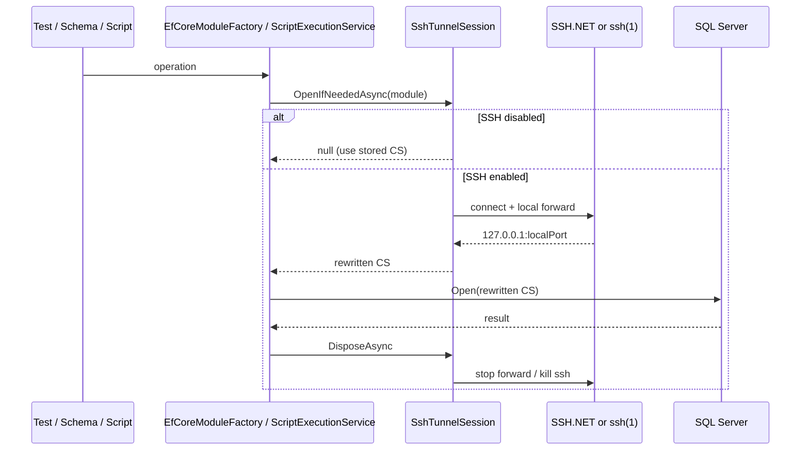

# SSH Tunnel

ScratchpadSharp can reach a networked database through an optional **SSH local port forward**, in the same way as DBeaver: you keep the database host as seen **from the SSH server**, and the app opens `127.0.0.1:<localPort>` for the actual ADO.NET / EF Core connection.

SQL Server supports this today. SQLite does not (file-based). Other TCP providers can reuse the same path later.

See [EF Core modules](ef-core.md) for module create / query refs.

## Configure

1. Open **Modules** → **Add database** or **Edit connection**.
2. Choose **SQL Server**.
3. Expand **SSH Tunnel** and check **Use SSH tunnel**.
4. Fill SSH **Host**, **Port** (default 22), **User name**.
5. Pick **Authentication**:
   - **Agent** — OpenSSH `ssh` on `PATH`, identities from `ssh-agent` (`SSH_AUTH_SOCK`)
   - **Password** — SSH user password (also answers keyboard-interactive prompts)
   - **Public key** — private key file (PEM / OpenSSH / PPK), optional passphrase
6. Set the SQL Server **Server address** to the host **as seen from the SSH box** (use `localhost` if SQL Server runs on that host).
7. **Test connection**, then **Save**.

### SSH advanced

| Field | Default | Meaning |
|---|---|---|
| Remote host | database server from the connection string | Destination of the forward, as resolved on the SSH server |
| Remote port | database port (SQL Server `1433` if omitted) | Destination TCP port |
| Local port | `0` (ephemeral) | Bind port on `127.0.0.1` |

Named SQL Server instances (`host\INSTANCE`) are not forwarded by name. The tunnel uses the TCP host (the part before `\`) and an explicit port — set `,port` on the server address or **Remote port**.

## What is stored

Module directory:

```
{LocalApplicationData}/ScratchpadSharp/modules/{instanceId}/
  module.json    # ConnectionString (remote, no Password=) + sshTunnel + encryptedDatabasePassword
  model.cs       # baked remote connection string in OnConfiguring (no password)
```

`module.json` keeps the **remote** database connection string. The tunneled loopback string is never persisted. `SshTunnel` is omitted or `enabled: false` when unused.

SQL and SSH **passwords** (and SSH key passphrases) are stored as `enc:v1:<base64>` blobs that only the **current OS user on this machine** can open. Copying `module.json` to another account or computer does not yield usable secrets.

| Platform | Protection |
|---|---|
| Windows | DPAPI `CurrentUser` (`ProtectedData`) plus app entropy |
| Linux | AES-GCM. Key = HKDF-SHA256 of `{LocalApplicationData}/ScratchpadSharp/user.key` (mode `0600`) with salt `machine-id` + user name |

`user.key` never leaves this profile. Deleting it, switching users, or moving the modules folder to another machine makes existing blobs unreadable.

Example:

```json
{
  "id": "...",
  "providerId": "SqlServer",
  "connectionString": "Server=localhost,1433;Database=app;User ID=sa;TrustServerCertificate=True",
  "encryptedDatabasePassword": "enc:v1:...",
  "sshTunnel": {
    "enabled": true,
    "host": "bastion.example",
    "port": 22,
    "username": "deploy",
    "authMethod": "Password",
    "password": "enc:v1:...",
    "remoteHost": "",
    "remotePort": 0,
    "localPort": 0
  }
}
```

The private key **path** is stored in clear text. Windows authentication (Integrated Security) does not use `encryptedDatabasePassword`.

### When a password cannot be unlocked

Test / scaffold / schema / script run decrypts secrets into a **working copy** of the module, then opens the tunnel if enabled.

If decrypt fails (wrong user, other machine, missing `user.key`, corrupt blob) or a required secret is empty:

1. The UI shows a dialog to re-enter that password (database, SSH password, or key passphrase).
2. On OK the new value is protected and written back to `module.json`.
3. Cancel (or headless `--headless run`, where there is no dialog) fails with a message to re-enter the secret in **Edit connection**.

Opening **Edit connection** decrypts into the form. If that fails, the password fields are empty and a status line asks you to type them again before Save.

## Connection management

SSH is **not** a long-lived pooled session. Config is saved on the module; a live tunnel exists only for one operation.

### Lifecycle

```
open tunnel  →  rewrite CS to 127.0.0.1:<localPort>  →  use DB  →  dispose
```

| Trigger | Owner | Tunnel lifetime |
|---|---|---|
| Test connection | `EfCoreModuleFactory.WithLiveConnectionAsync` | that call |
| Create module (schema scaffold) | same | that call |
| Refresh schema tree | same | that call |
| Regenerate model | same | that call |
| Run a script (or headless `--headless run`) | `ScriptExecutionService` + `SshTunnelScope` | compile **and** execute, then close |

`SshTunnelSession.OpenIfNeededAsync` returns `null` when `sshTunnel` is missing or `enabled` is false. The unlocked connection string (password injected, original host) is used.

`SshTunnelScope` still rewrites `model.cs` copies when only the database password was stripped from disk — not only when an SSH session exists.

Two overlapping operations (for example schema refresh while a script is running) open **two independent tunnels**. There is no sharing across tabs, no reconnect, and no idle cache.

### Open

1. Validate SSH host, port, user, and auth secrets.
2. Parse the database endpoint (`DatabaseEndpoint.Parse`) or use SSH advanced remote host/port.
3. Open a local forward: `127.0.0.1:<localPort>` → SSH server → `remoteHost:remotePort`.
4. Rewrite the **live** connection string to loopback (`DatabaseEndpoint.RewriteToLoopback`). SQL Server becomes `Data Source=127.0.0.1,<localPort>` with catalog / credentials unchanged.

Two backends:

| Auth | Implementation | Notes |
|---|---|---|
| Password / public key | SSH.NET `SshClient` + `ForwardedPortLocal` | Keep-alive 30s; connect timeout 15s; host keys currently **auto-trusted** |
| Agent | system `ssh -N -L 127.0.0.1:local:remoteHost:remotePort` | `BatchMode=yes`, `ExitOnForwardFailure=yes`, `ServerAliveInterval=30`; waits until localhost accepts (or times out at 15s) |

Agent auth requires the OpenSSH client on `PATH`. If `ssh` is missing, the error says so.

### Script runs

`SshTunnelScope` unlocks secrets for **each referenced module**, opens an SSH session when enabled, then patches a **copy** of each `model.cs` so `OnConfiguring` uses the live connection string (password, and loopback host when tunneled). The file on disk is not rewritten.

If the baked string cannot be found (hand-edited `model.cs`), execution fails with a message to **Regenerate model**.

After the script finishes, is cancelled, or fails to compile, `DisposeAsync` runs.

### Close

`SshTunnelSession.DisposeAsync`:

1. Stop the local forward (SSH.NET) if started.
2. Disconnect and dispose `SshClient`.
3. Dispose the loaded private key handle.
4. Kill the `ssh` process tree (agent path).

Failures during teardown are ignored so the other resources still release.



## Types

| Type | Role |
|---|---|
| `SshTunnelConfig` | Persisted settings (`ScratchpadSharp.Shared`) |
| `SshTunnelSession` | One live forward + rewritten connection string |
| `SshTunnelScope` | Unlock secrets, optional tunnels, rewrite `model.cs` copies, dispose |
| `UserSecretProtector` / `ModuleSecrets` | OS-user encryption and unlock / re-prompt |
| `DatabaseEndpoint` | Provider-specific parse / loopback rewrite |
| `DatabaseProviderInfo.SupportsSshTunnel` / `DefaultPort` | Feature flag for the connection dialog and rewrite |

UI: `DatabaseConnectionWindow` SSH expander, bound to `DatabaseConnectionViewModel`.

## Adding another TCP provider

1. Set `SupportsSshTunnel: true` and `DefaultPort` on `DatabaseProviderInfo`.
2. Add parse + `RewriteToLoopback` cases in `DatabaseEndpoint` (Npgsql `Host`/`Port`, MySQL `Server`/`Port`, …).
3. The dialog, `SshTunnelSession`, and script rewrite do not need provider-specific SSH code.

## Limits

- No jump hosts / extra hop.
- No `known_hosts` prompt (SSH.NET path trusts the server key).
- Agent path uses OpenSSH `known_hosts` as `ssh` would.
- TLS to `127.0.0.1` may need **Trust server certificate** on the SQL Server form.
- Local bind is `127.0.0.1` only.
- Headless runs use the same open/rewrite/dispose path as the UI, but cannot show the re-enter-password dialog.
- Secrets are bound to the current OS user on this machine; they are not portable with `module.json` alone.
